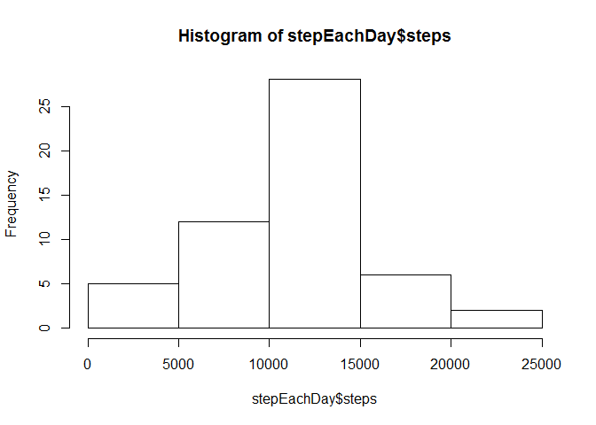
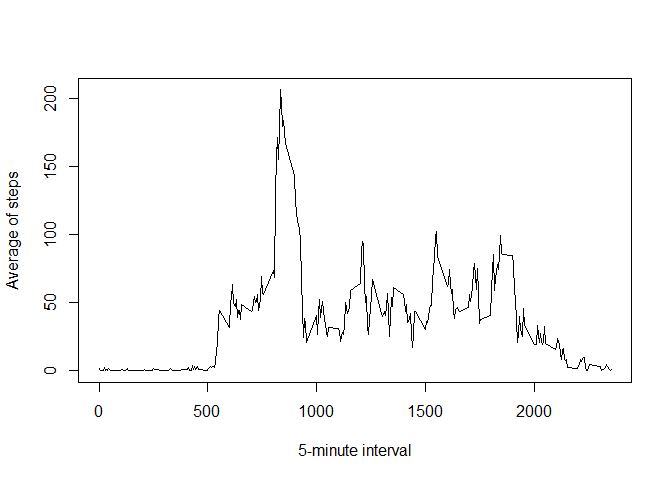
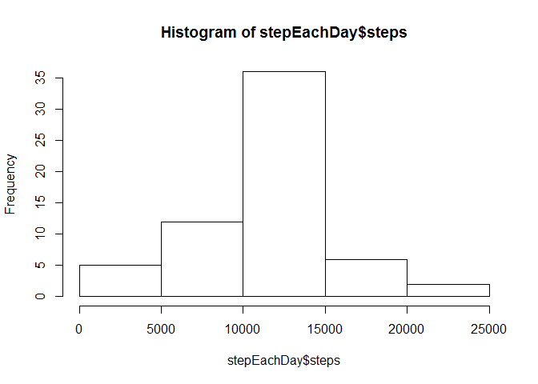

Activity Monitoring
===================

This assignment makes use of data from a personal activity monitoring device. This device collects data at 5 minute intervals through out the day. The data consists of two months of data from an anonymous individual collected during the months of October and November, 2012 and include the number of steps taken in 5 minute intervals each day.

The variables included in this dataset are:

* steps: Number of steps taking in a 5-minute interval (missing values are coded as NA)

* date: The date on which the measurement was taken in YYYY-MM-DD format

* interval: Identifier for the 5-minute interval in which measurement was taken


###Loading and preprocessing the data

```r
library(dplyr)
data<-read.csv("activity.csv")
datatbl <- tbl_df(data)
```

###What is mean total number of steps taken per day?

```r
groupData <- group_by(datatbl,date)
stepEachDay <- summarize(groupData,steps = sum(steps))
hist(stepEachDay$steps)
```

 

```r
meanVal <- mean(stepEachDay$steps,na.rm=T)
meanVal
```

```
## [1] 10766.19
```

```r
medianVal <- median(stepEachDay$steps,na.rm=T)
medianVal
```

```
## [1] 10765
```

The mean of the total number of steps taken per-day is  10766.19 and the median is 10765.

###What is the average daily activity pattern?

```r
groupData2 <- group_by(datatbl,interval)
avgStepEachDay <- summarize(groupData2,steps = mean(steps,na.rm=T))

plot(x=avgStepEachDay$interval,y=avgStepEachDay$steps,type="l",xlab="5-minute interval",ylab="Average of steps");
```

 

```r
maxSteps <- max(avgStepEachDay$steps);
maxdata <- filter(avgStepEachDay,steps>=maxSteps);
```

The 5-minute interval, on average across all the days in the dataset that contains the maximum number of steps is at interval835.

###Imputing missing values

```r
totNA <- sum(is.na(data$steps))
```

The total number of rows with NAs is 2304.

We will replace the NA with average value of the 5 minutes interval, then recalculate the data.


```r
#medianStepEachDay <- summarize(groupData2,steps = median(steps,na.rm=T))
dtNA<-filter(data,is.na(steps)==T)
dtMerge <-  merge(dtNA,avgStepEachDay,by.x="interval",by.y="interval")

dtNew <- subset(dtMerge,select=c("interval","date","steps.y"))
names(dtNew)<- c("interval","date","steps")
data$steps <- as.numeric(data$steps)
 
data2 <- union(data,dtNew)
data2 <- subset(data2,is.na(steps)==F)

datatbl <- tbl_df(data2)
groupData <- group_by(datatbl,date)
stepEachDay <- summarize(groupData,steps = sum(steps))
hist(stepEachDay$steps)
```

 

```r
meanVal <- mean(stepEachDay$steps,na.rm=T)
meanVal
```

```
## [1] 10766.19
```

```r
medianVal <- median(stepEachDay$steps,na.rm=T)
medianVal
```

```
## [1] 10766.19
```

The mean of the total number of steps taken per-day is  10766.19 and the median is 10766.19.
The mean values has no difference, but the median is changing, because we provide a complete data, with the mean of 5 minutes interval as the substitute.

###Are there differences in activity patterns between weekdays and weekends?

```r
data2$date2 <- as.POSIXlt(data2$date,format="%Y-%m-%d") 
data2$week <- data2$date2$wday 
data2$weektype <-   c( "weekend","weekday", "weekend")[findInterval(data2$week, c(0,1,5.5,7))]
data2<-data2[ , -which(names(data2) %in% c("date2","week"))]
library(lattice)
datatbl <- tbl_df(data2)
groupData2 <- group_by(datatbl,interval,weektype)
avgStepEachDay <- summarize(groupData2,steps = mean(steps,na.rm=T))


xyplot(steps ~ interval | factor(weektype), layout = c(1, 2),type = "l", data=avgStepEachDay, ylab = "Number of steps")
```

 

There is a slightly difference in activity patterns between weekdays and weekends, for weekdays, the peak is higher at 800s, and the rest of the day is not that high, but for weekend, the whole day, the peak is almost the same. 


